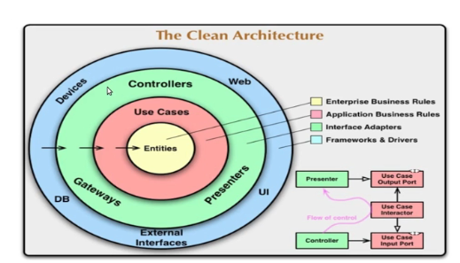

# JAVA-CLEAN-ARCHITECTURE

Projeto desenvolvido no curso:
https://www.udemy.com/share/107xvO3@bTBIG1fH-6IY0xolyzvSlc_HwrVYGls1vfigE5h1EervNhsap_D4bdFP5w31qWPZ/

Esse curso está voltado para a arquitetura, portanto, desconsidere as integrações do processo.

### Arquitetura clean


#### Objetivo
Fornecer uma maneira mais simples de organizar o código, assim o deixando mais reutilizável.

<p> Neste projeto a separação foi feita conforme abaixo: </p>

```
main
    config
    core
        dataprovider
        domain
        usecase
    dataprovider
        client
        repository
    entrypoint
        consumer
        controller
```

### Informações adicionais sobre a aplicação
Caso queira executar a aplicação, deve-se utilizar o wiremock para simular o serviço de endereço. <br />
Os jsons de configuração de request/response do wiremock estão anexados na pasta 'resources'. <br />

Comando para executar:
`java -jar wiremock-standalone-3.4.1.jar --port 8082`

#### Collection Postman
-> clean-arch-course.postman_collection.json